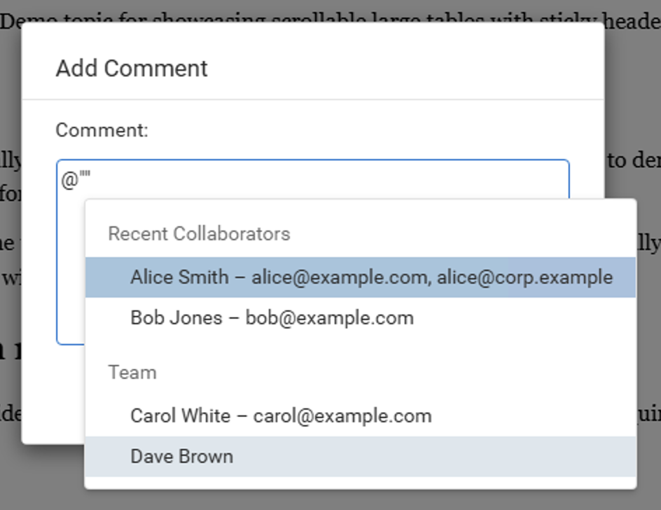

# web-author-custom-user-mentions

**Requires Web Author v28.1+**

This plugin replaces the default user mention proposals from review comments with a custom provider.

When a user types `@` in an Add/Edit Comment dialog, the proposals come from
`sync.api.author.UserMentionProposalsProvider` installed on
`sync.api.author.ReviewCommentsManager`.

The sample provider returns grouped users:
- `Users Who Already Have Access`
- `Users Who Need To Be Invited`

It also includes duplicate usernames with different emails so the mention list shows merged
entries with all associated emails.

## Review Comment Hooks

This sample also registers multiple `sync.api.author.ReviewCommentHook` instances on the
same `sync.api.author.ReviewCommentsManager`.

When a hook method runs from the Add/Edit Comment dialog, the plugin tries to show a short
console message so you can see which hook and lifecycle method was invoked.
These hooks only apply to comment add/edit dialog flows, not to every possible way review
markup could be changed.

The sample hooks demonstrate:
- Before insert/edit validation where `Alice Smith` and `Bob Jones` are already allowed,
  while `Carol White` and `Dave Brown` are treated as users who still need an invitation.
- Rejection of a comment save when a mention is not yet allowed.
- After insert/edit demo notifications listing which users would be notified.
- After insert demo notifications listing which users would receive the reviewer role.

The post-insert hooks in this sample do not make network requests. They only show
informational console messages so you can observe when each hook runs without triggering
backend errors.

## Screenshot

