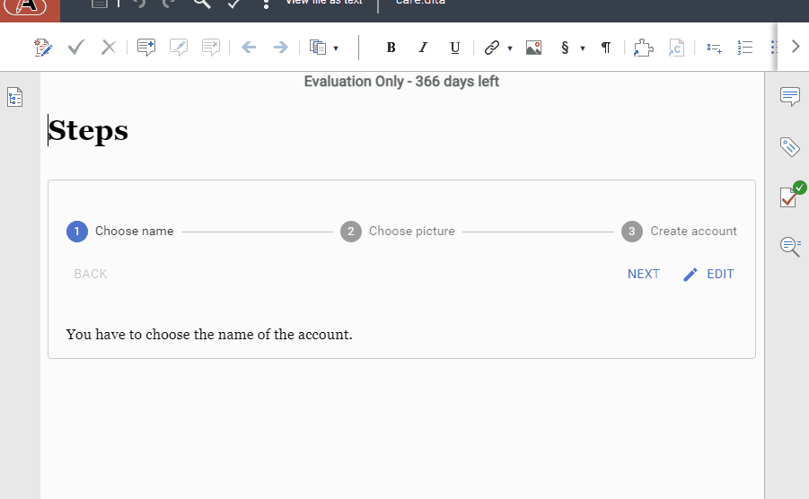

Web Author Form Control implemented with React
==============================================

A plugin that implements a Form Control using React.



How to build the plugin
-----------------------

Run the following commands:
```
npm install
npm run compile
mvn package
```

The plugin archive will be available in the `target/web-author-react-plugin-<version>-plugin.jar`.

How to test the plugin
----------------------

To add the form control in a topic, you can add the following structure:

```xml
<dl outputclass="stepper">
    <dlentry>
        <dt>Step 1</dt>
        <dd>Instructions 1</dd>
    </dlentry>
    <dlentry>
        <dt>Step 2</dt>
        <dd>Instructions 2</dd>
    </dlentry>
    <dlentry>
        <dt>Step 3</dt>
        <dd>Instructions 3</dd>
    </dlentry>
</dl>
```

How to develop the plugin
-------------------------

Run the following commands:
```
mvn compile
npm run watch
```

Then, follow the instructions here: https://www.oxygenxml.com/doc/ug-waCustom/topics/webapp-plugin-prototyping.html

Our customization guide contains some more details about implementing a custom form control: https://www.oxygenxml.com/doc/ug-waCustom/topics/customizing_frameworks.html#customizing_frameworks__li_bgs_dgk_54b .
