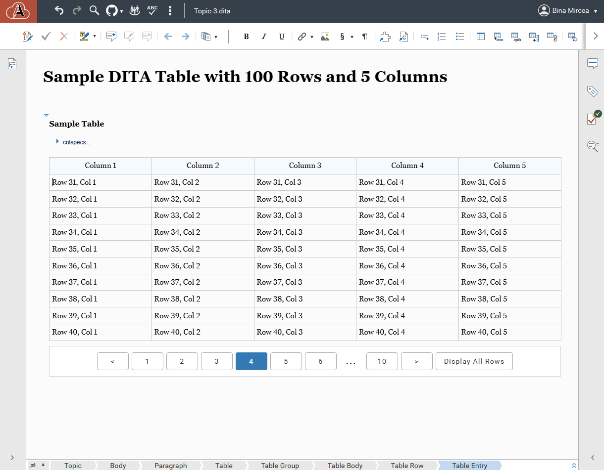

# Web Author Table Pagination Plugin (for Web Author v27.1+)

A plugin that adds a table pagination functionality to tables (that have the `<tgroup>` element) with more than 10 rows. 

This plugin significantly improves performance when editing very large tables.

*Note:* If you are using a version of Web Author earlier than 27.1 and want to use this plugin, please contact us at support@oxygenxml.com.



How it works:
- It adds a form control if there are tables with more than 10 rows - page size is 10 rows (this number can be changes easily by editing the code)
- There is a button to disable pagination for a table or enable it again.
- There is an additional editor message when the editor is not in “no tags” mode with a button to enable that mode.
- When an action (such as undo or find/replace) moves the selection into the table, the specific page containing the selection is shown.

Limitations:
- It is disabled when there is a diff view (comparison between two files).
- It removes the table row/column drag handle functionality used to reorder rows.

How to build the plugin
-----------------------

Run the following commands:
```
mvn package
```

The plugin archive will be available in the `target/web-author-react-plugin-<version>-plugin.jar`.

How to develop the plugin
-------------------------

Run the following commands:
```
mvn compile
```

Then, follow the instructions here: https://www.oxygenxml.com/doc/ug-waCustom/topics/webapp-plugin-prototyping.html

Our customization guide contains some more details about implementing a custom form control: https://www.oxygenxml.com/doc/ug-waCustom/topics/customizing_frameworks.html#customizing_frameworks__li_bgs_dgk_54b .
